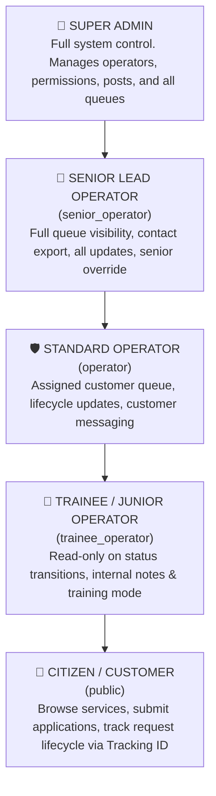
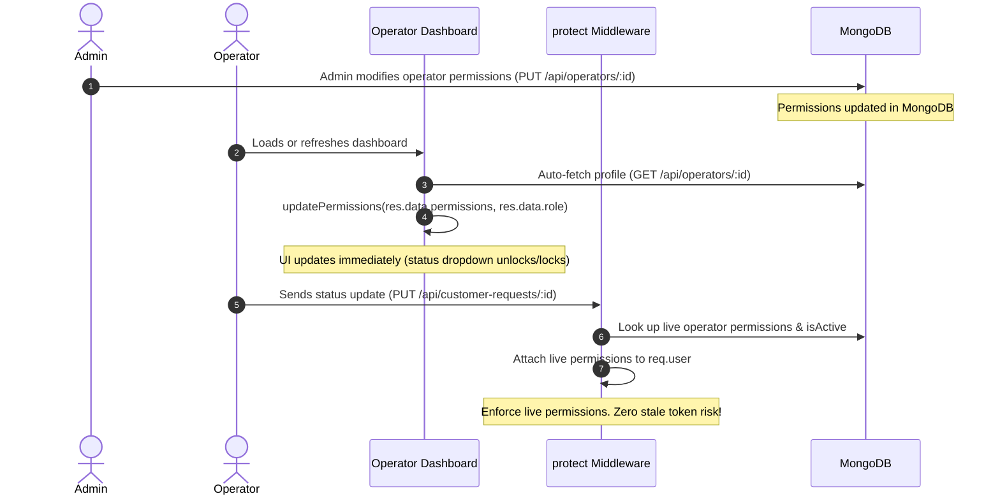

# Role-Based Access Control (RBAC) & Granular Permissions System Design

> **Architecture Specification & Security Reference**  
> Enterprise-grade Role-Based Access Control (RBAC) with granular functional permissions, dynamic database synchronization, rate-limiting, and account lockout policies.

---

## 1. Role Hierarchy



---

## 2. Granular Permission Matrix

In addition to coarse-grained role classification, every operator has a granular permission set configured by the Admin in the database.

| Functional Permission | Trainee Operator | Standard Operator | Senior Lead Operator | Super Admin | Description |
|---|:---:|:---:|:---:|:---:|---|
| `canUpdateStatus` | ❌ *(Locked)* | ✅ *(Default)* | ✅ *(Locked On)* | ✅ *(Full)* | Update customer application lifecycle stages (`under_review`, `in_progress`, `completed`, `rejected`). |
| `canAddNotes` | ✅ | ✅ | ✅ | ✅ | Add internal operator notes and citizen guidance messages. |
| `canViewAllRequests` | ❌ | ❌ *(Assigned only)* | ✅ *(Full Queue)* | ✅ *(All)* | Switch between assigned queue and full central system queue. |
| `canExportContacts` | ❌ | ❌ | ✅ *(CSV Export)* | ✅ *(Full)* | Download customer contacts, phones, and emails as CSV. |
| `canEditProfile` | ❌ | ✅ | ✅ | ✅ | Modify personal phone, email, WhatsApp, and bio. |

---

## 3. Dynamic Live Permission Architecture

### The Problem in Traditional JWT RBAC
In standard JWT architectures, user permissions are encoded in the token payload at login time. If an Admin modifies an operator's permissions in the database, the operator retains their old permissions until their JWT token expires or until they log out.

### The Digital Seva Live Sync Solution



---

## 4. Backend Implementation & Middleware

### 4.1 Live Token Resolution (`backend/middleware/auth.js`)
The `protect` middleware decodes the JWT token and cross-references live permissions from MongoDB:

```javascript
const protect = async (req, res, next) => {
    let token;
    const authHeader = req.headers.authorization;
    if (authHeader && authHeader.startsWith('Bearer ')) {
        token = authHeader.split(' ')[1];
    }
    if (!token) return res.status(401).json({ message: 'Not authorized, no token' });

    try {
        const decoded = jwt.verify(token, process.env.JWT_SECRET);
        let permissions = decoded.permissions || {};
        let operatorRole = decoded.operatorRole || (decoded.role === 'admin' ? 'admin' : 'operator');

        // Dynamic Database Verification: Fetch live permissions
        if (decoded.role === 'operator' && (decoded.operatorId || decoded.id)) {
            try {
                const op = await Operator.findById(decoded.operatorId || decoded.id).select('role permissions isActive');
                if (op) {
                    if (!op.isActive) {
                        return res.status(403).json({ message: 'Account is deactivated. Contact admin.' });
                    }
                    if (op.permissions) permissions = op.permissions;
                    if (op.role) operatorRole = op.role;
                }
            } catch (dbErr) {
                // Fallback to token payload if DB lookup is temporarily unreachable
            }
        }

        req.user = {
            id: decoded.id,
            role: decoded.role || 'admin',
            operatorRole,
            permissions,
            operatorId: decoded.operatorId || decoded.id
        };
        next();
    } catch (error) {
        return res.status(401).json({ message: 'Token invalid or expired' });
    }
};
```

### 4.2 Granular Endpoint Authorization (`routes/customerRequests.js`)
When an operator updates request status, granular permissions are strictly validated:

```javascript
router.put('/:id', protect, authorize('admin', 'operator'), async (req, res) => {
    const { status, operatorNotes, operatorMessage } = req.body;

    // Granular RBAC Check
    if (req.user.role === 'operator') {
        if (status && status !== request.status && req.user.permissions?.canUpdateStatus === false) {
            return res.status(403).json({ message: 'Permission denied: Your role cannot update request status' });
        }
        if ((operatorNotes !== undefined || operatorMessage !== undefined) && req.user.permissions?.canAddNotes === false) {
            return res.status(403).json({ message: 'Permission denied: Your role cannot add notes or customer messages' });
        }
    }
    // ...proceed with audit trail recording
});
```

---

## 5. Frontend Authentication & State Management

### 5.1 AuthContext (`frontend/src/context/AuthContext.jsx`)
`AuthContext` provides role and permission helper functions with safe fallback defaults:

```javascript
const hasPermission = useCallback((permissionName) => {
    if (!user) return false;
    if (user.role === 'admin') return true; // Super admin has all rights
    const opRole = user.operatorRole || user.role;
    if (opRole === 'senior_operator') return true; // Senior lead operator has full rights

    // Check explicit permission from user.permissions object
    if (user.permissions && user.permissions[permissionName] !== undefined) {
        return Boolean(user.permissions[permissionName]);
    }

    // Default fallbacks according to operator schema
    if (permissionName === 'canUpdateStatus' || permissionName === 'canAddNotes' || permissionName === 'canEditProfile') {
        return true;
    }

    return false;
}, [user]);
```

### 5.2 Operator Login (`frontend/src/pages/OperatorLogin.jsx`)
Stores credentials, role, and permission payload into `localStorage`:

```javascript
const res = await API.post('/auth/operator/login', form);
login(res.data.token, {
    id: res.data.operatorId,
    role: 'operator',
    operatorId: res.data.operatorId,
    name: res.data.name,
    operatorRole: res.data.operatorRole || 'operator',
    permissions: res.data.permissions || {}
});
```

### 5.3 Live Sync on Mount (`frontend/src/pages/OperatorDashboard.jsx`)
Automatically refreshes permissions whenever the operator opens or refreshes the portal:

```javascript
useEffect(() => {
    const fetchProfile = async () => {
        try {
            const opId = user?.operatorId || user?.id;
            if (!opId) return;
            const res = await API.get(`/operators/${opId}`);
            setProfile(res.data);
            if (res.data?.permissions && updatePermissions) {
                updatePermissions(res.data.permissions, res.data.role);
            }
        } catch (e) { console.error(e); }
    };
    fetchProfile();
}, [user?.operatorId, user?.id]);
```

---

## 6. Route Protection Matrix

| Route Path | Allowed Roles | Middleware Required | Functional Guard |
|---|---|---|---|
| `GET /api/posts` | All (Public) | None | None |
| `POST /api/posts` | Admin | `protect`, `authorize('admin')` | None |
| `PUT /api/posts/:id` | Admin | `protect`, `authorize('admin')` | None |
| `DELETE /api/posts/:id` | Admin | `protect`, `authorize('admin')` | None |
| `GET /api/operators` | All (Public) | None | Masks sensitive credentials |
| `POST /api/operators` | Admin | `protect`, `authorize('admin')` | Auto-assigns sort order & default perms |
| `PUT /api/operators/:id` | Admin | `protect`, `authorize('admin')` | Updates roles and granular perms |
| `POST /api/customer-requests` | All (Public) | None | Auto-assigns via round-robin |
| `GET /api/customer-requests/track/:q`| All (Public) | None | Masks citizen names |
| `GET /api/customer-requests` | Admin | `protect`, `authorize('admin')` | Full central queue |
| `GET /api/customer-requests/mine` | Operator | `protect`, `authorize('operator')` | Filtered by assigned operator (or all if `canViewAllRequests`) |
| `PUT /api/customer-requests/:id` | Admin, Operator | `protect`, `authorize('admin', 'operator')` | Validates `canUpdateStatus` and `canAddNotes` |

---

## 7. Security Hardening & Defenses

| Security Threat | Implemented Defense | Implementation Detail |
|---|---|---|
| **Brute-Force Credential Stuffing** | `loginLimiter` Rate Limiter | Max 5 login attempts per 15-minute window per IP (`express-rate-limit`). |
| **Password Guessing Attacks** | Account Lockout | 5 consecutive failed attempts lock the account for 15 minutes (`checkAccountLockout`). |
| **Password Storage** | Salted bcrypt Hashing | Passwords hashed with 10 salt rounds (`bcryptjs`). Passwords excluded from all JSON serializations (`toJSON`). |
| **Session Inactivity Exposure** | Auto-Logout Timer | 30 minutes of user inactivity triggers automatic session termination. |
| **Privilege Escalation** | Server-Side Enforcement | Front-end UI flags are purely ergonomic; all permissions are strictly enforced on backend API routes. |
| **Cross-Origin Abuse** | CORS Whitelisting | Strict origin checking against allowed domains (`http://localhost:5173`, production domains). |
