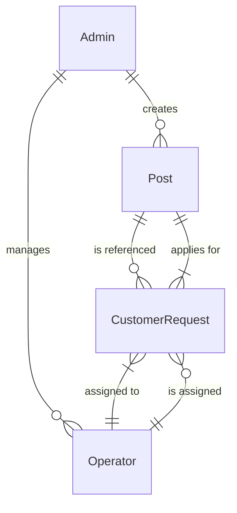

# Database Schema Design

> Complete MongoDB schema design with all models for the industry-standard Digital Seva platform.

---

## 1. Entity Relationship Diagram



---

## 2. Model: Admin (Enhanced)

**Collection**: `admins`

| Field       | Type     | Required | Unique | Default    | Notes                    |
|-------------|----------|:--------:|:------:|------------|--------------------------|
| `_id`       | ObjectId | auto     | ✅     | auto       | MongoDB auto-generated   |
| `username`  | String   | ✅       | ✅     | —          | Login username           |
| `password`  | String   | ✅       | —      | —          | bcrypt hashed            |
| `role`      | String   | ✅       | —      | `"admin"`  | Always "admin"           |
| `createdAt` | Date     | auto     | —      | auto       | Mongoose timestamps      |
| `updatedAt` | Date     | auto     | —      | auto       | Mongoose timestamps      |

### Schema Definition
```javascript
const AdminSchema = new mongoose.Schema({
    username: { type: String, required: true, unique: true },
    password: { type: String, required: true },
    role: { type: String, default: 'admin', immutable: true }
}, { timestamps: true });
```

> **Change from current**: Added `role` field with default `"admin"`.

---

## 3. Model: Operator (Enhanced)

**Collection**: `operators`

| Field               | Type     | Required | Unique | Default  | Notes                         |
|---------------------|----------|:--------:|:------:|----------|-------------------------------|
| `_id`               | ObjectId | auto     | ✅     | auto     | MongoDB auto-generated        |
| `name`              | String   | ✅       | —      | —        | Operator display name         |
| `phone`             | String   | ✅       | ✅     | —        | Primary phone (login ID)      |
| `password`          | String   | ✅       | —      | —        | bcrypt hashed (NEW)           |
| `email`             | String   | —        | —      | —        | Optional email                |
| `age`               | Number   | —        | —      | —        | Optional age                  |
| `address`           | String   | —        | —      | —        | Location                      |
| `photoUrl`          | String   | —        | —      | `""`     | Profile photo                 |
| `whatsapp`          | String   | —        | —      | —        | WhatsApp number               |
| `whatsappGroupLink` | String   | —        | —      | `""`     | Group join link               |
| `bio`               | String   | —        | —      | `""`     | Short bio                     |
| `isActive`          | Boolean  | —        | —      | `true`   | Can receive requests          |
| `sortOrder`         | Number   | —        | —      | `0`      | Display ordering              |
| `role`              | String   | —        | —      | `"operator"` | Always "operator" (NEW)   |
| `totalAssigned`     | Number   | —        | —      | `0`      | Requests assigned count (NEW) |
| `totalCompleted`    | Number   | —        | —      | `0`      | Requests completed count (NEW)|
| `lastAssignedAt`    | Date     | —        | —      | `null`   | For round-robin tracking (NEW)|
| `createdAt`         | Date     | auto     | —      | auto     | Mongoose timestamps           |
| `updatedAt`         | Date     | auto     | —      | auto     | Mongoose timestamps           |

### Schema Definition
```javascript
const OperatorSchema = new mongoose.Schema({
    name: { type: String, required: true },
    phone: { type: String, required: true, unique: true },
    password: { type: String, required: true },  // NEW
    email: { type: String },
    age: { type: Number },
    address: { type: String },
    photoUrl: { type: String, default: '' },
    whatsapp: { type: String },
    whatsappGroupLink: { type: String, default: '' },
    bio: { type: String, default: '' },
    isActive: { type: Boolean, default: true },
    sortOrder: { type: Number, default: 0 },
    role: { type: String, default: 'operator', immutable: true },  // NEW
    totalAssigned: { type: Number, default: 0 },    // NEW
    totalCompleted: { type: Number, default: 0 },   // NEW
    lastAssignedAt: { type: Date, default: null }    // NEW
}, { timestamps: true });

// Pre-save hook for password hashing
OperatorSchema.pre('save', async function() {
    if (!this.isModified('password')) return;
    const salt = await bcrypt.genSalt(10);
    this.password = await bcrypt.hash(this.password, salt);
});

// Password comparison method
OperatorSchema.methods.matchPassword = async function(enteredPassword) {
    return await bcrypt.compare(enteredPassword, this.password);
};
```

> **Changes from current**: Added `password`, `role`, `totalAssigned`, `totalCompleted`, `lastAssignedAt` fields. Made `phone` unique. Added password hashing pre-save hook.

---

## 4. Model: Post (No Changes)

**Collection**: `posts`

| Field            | Type       | Required | Default  | Notes                          |
|------------------|------------|:--------:|----------|--------------------------------|
| `_id`            | ObjectId   | auto     | auto     | MongoDB auto-generated         |
| `titleEn`        | String     | ✅       | —        | English title                  |
| `titleTe`        | String     | ✅       | —        | Telugu title                   |
| `imageUrl`       | String     | —        | `""`     | Image/Doc preview URL          |
| `startDate`      | Date       | ✅       | —        | Application start date         |
| `endDate`        | Date       | ✅       | —        | Application end date           |
| `requiredDocsEn` | [String]   | —        | `[]`     | Documents needed (English)     |
| `requiredDocsTe` | [String]   | —        | `[]`     | Documents needed (Telugu)      |
| `extraInfoEn`    | String     | —        | `""`     | Additional info (English)      |
| `extraInfoTe`    | String     | —        | `""`     | Additional info (Telugu)       |
| `category`       | String     | —        | `"other"`| Enum: job/pan/aadhaar/etc.     |
| `notificationUrl`| String     | —        | `""`     | Official notification link     |
| `createdAt`      | Date       | auto     | auto     | Mongoose timestamps            |
| `updatedAt`      | Date       | auto     | auto     | Mongoose timestamps            |

> **No changes needed** — Post model remains the same.

---

## 5. Model: CustomerRequest (NEW)

**Collection**: `customerrequests`

This is the **core new model** that connects customers to operators through service posts.

| Field            | Type       | Required | Default       | Notes                              |
|------------------|------------|:--------:|---------------|------------------------------------|
| `_id`            | ObjectId   | auto     | auto          | MongoDB auto-generated             |
| `customerName`   | String     | ✅       | —             | Applicant's full name              |
| `customerAge`    | Number     | —        | —             | Applicant's age                    |
| `customerPhone`  | String     | ✅       | —             | Phone number for contact           |
| `customerEmail`  | String     | —        | —             | Email for notifications            |
| `customerMessage`| String     | —        | `""`          | Optional message from customer     |
| `postId`         | ObjectId   | ✅       | —             | Ref → `Post` (service applied for) |
| `serviceName`    | String     | ✅       | —             | Denormalized service/post title    |
| `serviceCategory`| String     | —        | —             | Denormalized category              |
| `assignedTo`     | ObjectId   | —        | `null`        | Ref → `Operator`                   |
| `assignedAt`     | Date       | —        | `null`        | When assignment was made           |
| `status`         | String     | ✅       | `"pending"`   | Request lifecycle status           |
| `operatorNotes`  | String     | —        | `""`          | Operator's internal notes          |
| `operatorMessage`| String     | —        | `""`          | Message to customer from operator  |
| `statusHistory`  | [Object]   | —        | `[]`          | Audit trail of status changes      |
| `priority`       | String     | —        | `"normal"`    | Request priority level             |
| `completedAt`    | Date       | —        | `null`        | When request was resolved          |
| `createdAt`      | Date       | auto     | auto          | Mongoose timestamps                |
| `updatedAt`      | Date       | auto     | auto          | Mongoose timestamps                |

### Status Enum
```
pending → assigned → in_progress → contacted → completed
                                              → rejected
                                              → cancelled
```

### Priority Enum
```
low | normal | high | urgent
```

### Schema Definition
```javascript
const CustomerRequestSchema = new mongoose.Schema({
    // Customer Information
    customerName: { type: String, required: true, trim: true },
    customerAge: { type: Number, min: 1, max: 150 },
    customerPhone: { type: String, required: true, trim: true },
    customerEmail: { type: String, trim: true, lowercase: true },
    customerMessage: { type: String, default: '', maxlength: 1000 },

    // Service Reference
    postId: {
        type: mongoose.Schema.Types.ObjectId,
        ref: 'Post',
        required: true
    },
    serviceName: { type: String, required: true },    // denormalized
    serviceCategory: { type: String },                 // denormalized

    // Assignment
    assignedTo: {
        type: mongoose.Schema.Types.ObjectId,
        ref: 'Operator',
        default: null
    },
    assignedAt: { type: Date, default: null },

    // Status Tracking
    status: {
        type: String,
        enum: ['pending', 'assigned', 'in_progress', 'contacted', 'completed', 'rejected', 'cancelled'],
        default: 'pending'
    },

    // Operator Response
    operatorNotes: { type: String, default: '' },     // Internal notes
    operatorMessage: { type: String, default: '' },   // Message to customer

    // Status History (audit trail)
    statusHistory: [{
        status: String,
        changedBy: { type: mongoose.Schema.Types.ObjectId },
        changedByRole: String,
        timestamp: { type: Date, default: Date.now },
        note: String
    }],

    // Metadata
    priority: {
        type: String,
        enum: ['low', 'normal', 'high', 'urgent'],
        default: 'normal'
    },
    completedAt: { type: Date, default: null }
}, { timestamps: true });

// Indexes for performance
CustomerRequestSchema.index({ assignedTo: 1, status: 1 });
CustomerRequestSchema.index({ postId: 1 });
CustomerRequestSchema.index({ status: 1, createdAt: -1 });
CustomerRequestSchema.index({ customerPhone: 1 });
```

---

## 6. Model: AssignmentCounter (NEW — Optional)

**Collection**: `assignmentcounters`

For round-robin assignment tracking.

| Field              | Type     | Required | Default | Notes                        |
|--------------------|----------|:--------:|---------|------------------------------|
| `_id`              | ObjectId | auto     | auto    | MongoDB auto-generated       |
| `lastAssignedIndex`| Number   | ✅       | `0`     | Index of last assigned operator |
| `totalRequests`    | Number   | ✅       | `0`     | Total requests distributed   |

### Schema Definition
```javascript
const AssignmentCounterSchema = new mongoose.Schema({
    lastAssignedIndex: { type: Number, default: 0 },
    totalRequests: { type: Number, default: 0 }
});
```

---

## 7. Data Flow Diagrams

### Customer Request Submission
```
Customer fills form on PostDetailPage
         ↓
POST /api/customer-requests
  Body: { customerName, customerAge, customerPhone, customerEmail,
          customerMessage, postId }
         ↓
Server:
  1. Validate required fields
  2. Fetch Post to get serviceName & serviceCategory
  3. Get all active operators
  4. Select operator (Round-Robin algorithm)
  5. Create CustomerRequest with assignedTo
  6. Update operator's totalAssigned & lastAssignedAt
  7. Add "assigned" to statusHistory
  8. Return success response
```

### Operator Views Requests
```
GET /api/customer-requests/mine
  Header: Authorization: Bearer <operator_token>
         ↓
Server:
  1. Verify JWT → extract operatorId
  2. Query CustomerRequest where assignedTo == operatorId
  3. Populate postId for service details
  4. Sort by status priority & createdAt
  5. Return paginated results
```

---

## 8. Indexing Strategy

| Collection         | Index                                | Purpose                     |
|--------------------|--------------------------------------|-----------------------------|
| `admins`           | `{ username: 1 }` (unique)          | Login lookup                |
| `operators`        | `{ phone: 1 }` (unique)             | Login lookup                |
| `operators`        | `{ isActive: 1, sortOrder: 1 }`     | Public listing + assignment |
| `posts`            | `{ category: 1, createdAt: -1 }`    | Filtered listing            |
| `customerrequests` | `{ assignedTo: 1, status: 1 }`      | Operator dashboard query    |
| `customerrequests` | `{ status: 1, createdAt: -1 }`      | Admin overview              |
| `customerrequests` | `{ postId: 1 }`                     | Request by service          |
| `customerrequests` | `{ customerPhone: 1 }`              | Duplicate detection         |
