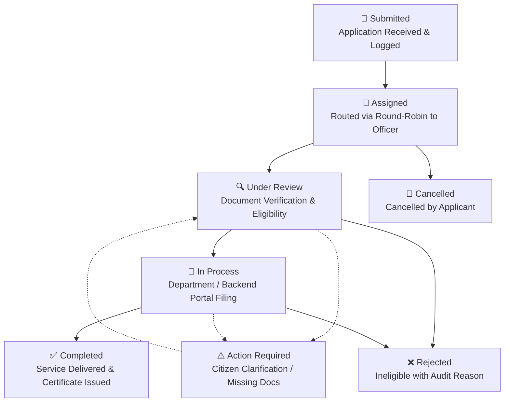

# Customer Request Lifecycle & Citizen Tracking System

> **Architecture Specification & Implementation Guide**  
> Industry-standard e-governance service lifecycle engine, tracking reference generation, audit trail logging, and public citizen tracking portal.

---

## 1. Architectural Overview

The Digital Seva platform implements an enterprise e-governance request lifecycle modeled after national service portals (such as MeeSeva, Passport Seva, and CSC Digital India). Every citizen application progresses through auditable lifecycle stages with complete transparency.



---

## 2. Standardized Lifecycle States

| State Key | Citizen Display Title | Stage Type | Permissions Required | Description |
|---|---|---|---|---|
| `submitted` | **Application Submitted** | Entry Milestone | System | Citizen application captured via public form; tracking ID generated. |
| `assigned` | **Assigned to Officer** | Routing Milestone | System / Admin | Auto-assigned via fair round-robin or manual admin assignment. |
| `under_review` | **Under Review & Verification** | Processing Stage | Operator (`canUpdateStatus`) | Operator verifies identity, supporting proofs, and eligibility. |
| `in_progress` | **In Process** | Active Fulfillment | Operator (`canUpdateStatus`) | Application is actively being filed on government/provider backend. |
| `action_required` | **Action Required from Citizen** | Exception Stage | Operator (`canUpdateStatus`) | Additional documentation or applicant clarification needed. |
| `completed` | **Service Completed & Delivered** | Terminal (Success) | Operator (`canUpdateStatus`) | Service fulfilled; receipts/acknowledgement delivered to citizen. |
| `rejected` | **Application Rejected** | Terminal (Failure) | Operator (`canUpdateStatus`) | Request cannot be fulfilled; reason recorded in audit trail. |
| `cancelled` | **Cancelled by Citizen** | Terminal (Revocation)| Admin / Citizen | Request cancelled upon applicant request. |
| `pending` *(legacy)* | *Pending Review* | Backward-compat | Operator | Legacy alias mapped to `assigned`. |
| `contacted` *(legacy)* | *Citizen Contacted* | Backward-compat | Operator | Legacy alias mapped to `under_review`. |

---

## 3. Tracking ID Specification

### 3.1 Format
```
DS-YYYY-XXXXX
```
- `DS`: Digital Seva prefix
- `YYYY`: 4-digit calendar year (e.g. `2026`)
- `XXXXX`: 5-digit cryptographically random integer (`10000` to `99999`)
- Example: `DS-2026-77009`, `DS-2026-13341`

### 3.2 Generation Hook (`CustomerRequest.js`)
```javascript
CustomerRequestSchema.pre('validate', function () {
    if (!this.trackingId) {
        const year = new Date().getFullYear();
        const rand = Math.floor(10000 + Math.random() * 90000);
        this.trackingId = `DS-${year}-${rand}`;
    }
});
```

### 3.3 Database Indexing
```javascript
CustomerRequestSchema.index({ trackingId: 1 }, { unique: true, sparse: true });
CustomerRequestSchema.index({ customerPhone: 1 });
CustomerRequestSchema.index({ status: 1, createdAt: -1 });
CustomerRequestSchema.index({ assignedTo: 1, status: 1 });
```

---

## 4. Immutable Audit Trail (`statusHistory`)

Every transition appends a detailed milestone record to the request document:

```json
{
  "status": "in_progress",
  "title": "In Process",
  "changedBy": "6aa549e2ee4fc77059d19c83",
  "changedByRole": "operator",
  "timestamp": "2026-09-14T04:33:10.123Z",
  "note": "Aadhaar verified. Uploading application to Meeseva portal."
}
```

- **Auditable Accountability**: Records the operator ID, system event, or admin ID that triggered the transition.
- **Citizen Visibility**: Non-sensitive milestone titles, timestamps, and notes are exposed on the public tracking portal.
- **Data Segregation**: Internal private notes (`operatorNotes`) remain hidden from public API responses.

---

## 5. Public Citizen Tracking Portal

### 5.1 Endpoint Specification

#### `GET /api/customer-requests/track/:query`
- **Access**: Public (No authentication required)
- **Input**: Query parameter accepts either:
  1. `trackingId`: Case-insensitive tracking ID (e.g., `DS-2026-77009` or `77009`)
  2. `customerPhone`: 10-digit clean mobile number (returns all requests for that applicant)
- **Privacy Masking**: Citizen names are dynamically masked (e.g., `Srinivas Lingampelli` -> `S****s L***i`).
- **Response**:
```json
{
  "count": 1,
  "requests": [
    {
      "_id": "6aa549e2ee4fc77059d19c99",
      "trackingId": "DS-2026-77009",
      "customerMaskedName": "S****s L***i",
      "serviceName": "Income Certificate Application",
      "serviceCategory": "Certificates",
      "status": "in_progress",
      "priority": "normal",
      "createdAt": "2026-09-12T12:00:00.000Z",
      "completedAt": null,
      "operatorMessage": "Please keep your ration card copy ready for call verification.",
      "assignedOperator": {
        "name": "Suresh Kumar",
        "phone": "9876543211",
        "whatsapp": "9876543211"
      },
      "statusHistory": [
        {
          "status": "submitted",
          "title": "Application Submitted",
          "timestamp": "2026-09-12T12:00:00.000Z",
          "note": "Service application submitted successfully by citizen"
        },
        {
          "status": "assigned",
          "title": "Assigned to Officer",
          "timestamp": "2026-09-12T12:00:01.000Z",
          "note": "Routed via automated round-robin to operator Suresh Kumar"
        },
        {
          "status": "in_progress",
          "title": "In Process",
          "timestamp": "2026-09-14T04:30:00.000Z",
          "note": "Documents verified, proceeding with portal submission"
        }
      ]
    }
  ]
}
```

### 5.2 Frontend Tracking Interface (`TrackRequestPage.jsx`)
- **Direct Deep-Linking**: Visiting `/track/DS-2026-77009` automatically executes the lookup on mount.
- **Search Bar**: Supports Tracking ID or 10-digit phone number.
- **Multi-Request Switcher**: When searched by phone, provides tabbed navigation between multiple applications.
- **Designated Officer Support**: 1-click WhatsApp button (`https://wa.me/91...`) pre-populated with tracking ID inquiry message and direct phone call trigger.
- **Lifecycle Stepper**: Interactive visual representation with live pulse indicators on active step.

---

## 6. Frontend Visual Lifecycle Stepper (`LifecycleStepper.jsx`)

The stepper component displays the 5-node progression with dynamic state handling:

```
[ ✔ Submitted ] ─── [ ✔ Assigned ] ─── [ 🔵 In Process ] ─── [ ⚪ Completed ]
```

### Visual Features:
1. **Completed Steps**: Green circle with white checkmark (`FiCheck`) and green connecting rail.
2. **Current Active Step**: Cyan highlight with expanding pulse animation (`pulseCurrent 2s infinite`).
3. **Action Required**: Amber warning badge (`FiAlertTriangle`) alerting the citizen to check officer notes.
4. **Rejected State**: Red highlight (`FiX`) showing exact milestone of rejection.
5. **Timestamp Sub-labels**: Displays the exact milestone date/time from `statusHistory`.

---

## 7. Operator & Admin Transition Workflow

1. **Assigned Operator View** ([`RequestCard.jsx`](file:///c:/Users/DELL/Desktop/Learn/Online-service-reactApp/frontend/src/components/RequestCard.jsx)):
   - Header shows tracking pill `#{trackingId}` with 1-click clipboard copy.
   - Stepper embedded directly in expanded card.
   - Status dropdown filtered by operator RBAC permission (`canUpdateStatus`).
   - Transition note input saves custom audit message when stage is updated.
   - Public customer message box sends instructions directly to the citizen's tracking portal.
2. **Admin View** ([`CustomerRequestsAdmin.jsx`](file:///c:/Users/DELL/Desktop/Learn/Online-service-reactApp/frontend/src/pages/CustomerRequestsAdmin.jsx)):
   - Comprehensive status filtering across all 8 lifecycle states.
   - Operator reassignment with automatic audit note recording.
